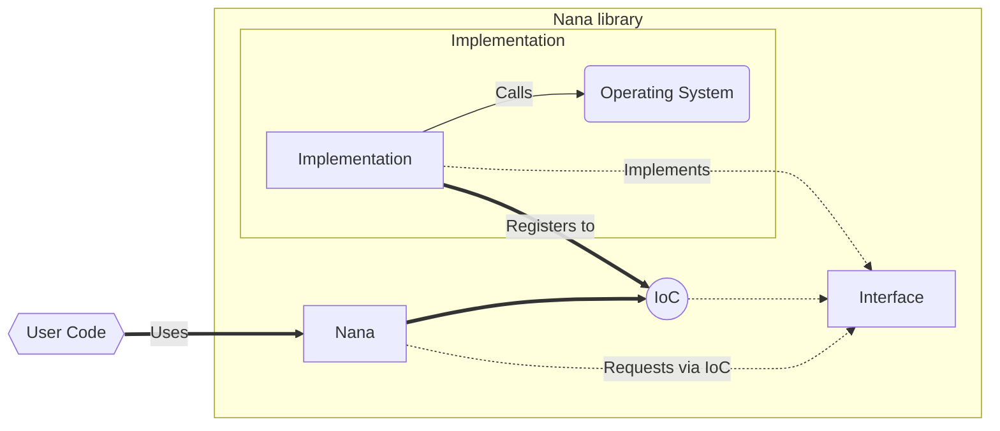

# Nana 2.0 (NGX)
We want to move nana to the "next generation". This is why `1.8` will be the last `1.X` release. Feel free to checkout our roadmap to 1.8 

But don't worry! We will continue to support version `1.8-LTS`!

## Roadmap
Work in progress roadmap for out first nana ngx release. **Please feel free to discuss and add your own features with us on GitHub**. (TODO: Insert link to issue)

- [ ] Inversion of control (IoC) - Full isolation between implementation and lib. [^1]
    * [ ] Implement IoC container. Interface registered as factory or singleton. Registering n details. Set ONE default detail. Query for default, X and X or fallback.
    * [ ] Implement custom public APIs consumed by nana. It should be possible to implement them in Usercode when needed. As many APIs as possible. The lib shall get as flexible as possible
- [ ] New / Reworked concepts:
    * [ ] Hierarchical exceptions. event --> widget --> nested_form --> form --> nana. Each part of the chain can handle and catch the exception or rethrow it. Idea: A form can close on an exception discarding all changes instead of crashing the whole event loop
    * [ ] Async API (`nana::exec`) like asio (`exec_once`, `exec_until`, `exec_for`, ...)
    * [ ] Multithread support via calling nana::exec multiple time. Idea: Internal event queue -> event handled by threads that called exec
    * [ ] Offload as much work as possible from the default messageproc(s)
    * [ ] Provide a `nana::mt_env` class that manages a thread pool and calls `nana::exec`. Interactions shall be `start()`, `stop()`, `suspend()` and `continue()`.
    * [ ] Job/Event system. An event is a suspended job waiting for scheduling. A job can run 1-inf times. A jobs first/next execution can be delayed. Jobs are places in the internal event queue when ready. A job is served by a thread calling exec. Expose the job/event API for the user code
    * [ ] WinForms like DialogResults and DialogWrappers
    * [ ] Dragger to configurable dockspace
    * [ ] Window & Dockspace (de-)serialization. Allow to save and restore form positions and layout. Out of the box via IoC
    * [ ] Backend per form. Forms should support it's own custom backend (drawing via winapi / d3d12 / ...) and should support the switching between backends. (Example: Main-Window as drawn by D3D12, Auxiliary windows draw by native winapi. Dockspace should still be intact)
- [ ] New Backends (user_code -> nana_draw -> IoC -> backend). User can add their own. We shall provide out of the box:
    * [ ] Update / Validate / Modify - WinAPI
    * [ ] Update / Validate / Modify - X11
    * [ ] Implement Vulkan (Win64, Linux)
    * [ ] Implement D3D12 (Win64)
- [ ] New / Updated / Revisited widgets:
    * [ ] Button :material-update:
    * [ ] Categorize :material-update:
    * [ ] Checkbox :material-update:
    * [ ] Combox :material-update:
    * [ ] Date Chooser :material-update:
    * [ ] Form :material-update:
    * [ ] Group :material-update:
    * [ ] Label :material-update:
    * [ ] Listbox :material-update:
    * [ ] Menu :material-update:
    * [ ] Menubar :material-update:
    * [ ] Nested Form :material-update:
    * [ ] Panel :material-update:
    * [ ] Picture :material-update:
    * [ ] Progress :material-update:
    * [ ] Radio Group :material-update:
    * [ ] Scroll :material-update:
    * [ ] Slider :material-update:
    * [ ] Spinbox :material-update:
    * [ ] Tabbar :material-update:
    * [ ] Textbox :material-update:
    * [ ] Toolbar :material-update:
    * [ ] Treebox :material-update:
    * [ ] Widget :material-update:
    * [ ] Render Panel :material-new-box: A panel for rendering into. We shall provide an integration for Vulkan, D3D12 and maybe OpenGl and D3D11.
- [ ] Other nana features
    * [ ] Painting / Drawing :material-update:
    * [ ] Animation :material-update:
    * [ ] i18n :material-update: (We definitely should change how i18n works...)
    * [ ] Drag and Drop :material-update:
    * [ ] msgbox, filebox, folderbox :material-update:
    * [ ] Dialog System :material-update: :material-new-box: Update inputbox into a modern extensible and more flexible system. Add-Hoc dialogs using the `<<` operator and a fluent interface. [^2]
- [ ] Lib delivery 
    * [ ] Platform Support
        - [x] Windows (amd64)
        - [ ] Windows (arm64) - Maybe
        - [x] Linux (amd64)
        - [ ] Linux (arm64) - Maybe
        - [ ] FreeBSD (amd64) 
        - [ ] FreeBSD (arm64) - Maybe
        - [ ] OSX (amd64) - Maybe
        - [ ] OSX (arm64) - Maybe
    * [ ] Compiler Support
        - [x] MSVC
        - [ ] G++
        - [ ] Clang
    * [ ] Packages:
        - [x] SourceCode via GitHub
        - [ ] Precompiled SDK as GitHub downloads (amd64 @Windows @Linux)
        - [ ] Conan2 package via conan center 
        - [ ] nuget - Maybe

[^1]: New abstraction concept

[^2]: Dialog concept example
```cpp
using namespace nana;

std::string name = "Max, Mustermann";
dialog d("My App 1234");
d << dialog::label("Edit Profile") 
  << dialog::input("Enter your name:", name).regex("..*, ..*", "Invalid format") 
  << dialog::button(dialog::btn_save).text("Save User")
  ; 
dialog_result result = d.show_dialog(*this).await();
if(result.button == dialog::btn_save)
{
    // TODO: Save record
}
```