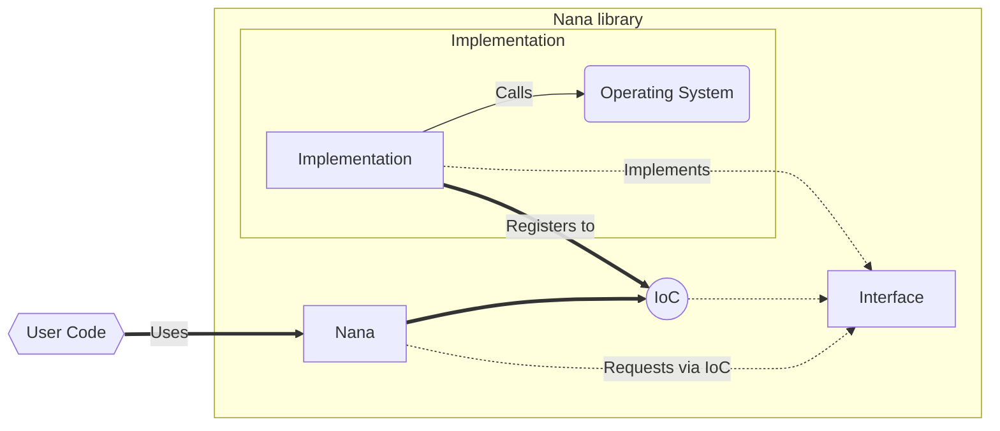

# Nana 2.x (NGX)
We want to move nana to the "next generation". This is why `1.8` will be the last `1.x` release. Feel free to checkout our roadmap to `v1.8-LTS`.

But don't worry! We will continue to support version `1.8-LTS`!

## Roadmap
Work in progress roadmap for out first nana ngx release. By no means complete or guaranteed. This is what I wish for a nana version `2.x`, also want your whishes to be recorded? Discuss with us!

**[Please feel free to discuss and add your own features with us on GitHub](#)**. 

- [ ] Inversion of control (IoC) - Full isolation between implementation and lib. [^1]
    * [ ] Implement IoC container. Interface registered as factory or singleton. Registering n details. Set ONE default detail. Query for default, X and X or fallback.
    * [ ] Implement custom public APIs consumed by nana. It should be possible to implement them in Usercode when needed. As many APIs as possible. The lib shall get as flexible as possible
    * [ ] Maybe implement multilevel IoC. We define multiple levels. Each implementation registers at a level. IoC will always resolve for the highest level. A high level can resolve a lower implementation via IoC then itself. With well defined levels chaining and replacing would be possible. This needs to be implemented in a (1. setup, 2. resolve, 3. run) approach to not bloat execution time.
- [ ] New / Reworked concepts:
    * [ ] Hierarchical exceptions. event --> widget --> nested_form --> form --> nana. Each part of the chain can handle and catch the exception or rethrow it. Idea: A form can close on an exception discarding all changes instead of crashing the whole event loop
    * [ ] Async API (`nana::exec`) like asio (`exec_once`, `exec_until`, `exec_for`, ...)
    * [ ] Multithread support via calling nana::exec multiple time. Idea: Internal event queue -> event handled by threads that called exec
    * [ ] Offload as much work as possible from the default messageproc(s) to job/events
    * [ ] Provide a `nana::mt_env` class that manages a thread pool and calls `nana::exec`. Interactions shall be `start()`, `stop()`, `suspend()` and `continue()`.
    * [ ] Job/Event system. An event is a job template waiting for instantiation and scheduling. A job can run 1-inf times. A jobs first/next execution can be delayed. Jobs are places in the internal event queue when ready. A job is served by a thread calling exec. Expose the job/event API for the user code
    * [ ] WinForms like DialogResults and DialogWrappers
    * [ ] Rework `dragger` to configurable `dockspace`
    * [ ] Window & Dockspace (de-)serialization. Allow to save and restore form positions and layout. (Out of the box via IoC)
    * [ ] Backend per form. Forms should support it's own custom backend (drawing via winapi / d3d12 / ...) and should support the switching between backends.
- [ ] New Backends. User can add their own. We shall provide out of the box:
    * [ ] Update / Validate / Modify - WinAPI
    * [ ] Update / Validate / Modify - X11
    * [ ] Implement Vulkan (Win64, Linux)
    * [ ] Implement D3D12 (Win64)
- [ ] Window host system. Responsible for window creation and calling events on backend. Default: Windows -> WinAPI, Linux -> X11
    * [ ] Windows: WinAPI
    * [ ] Linux: X11
    * [ ] Custom implementations possible (Maybe implement it for D3D12, Vulkan. With this feature it would be possible to integrate nana gui in existing rendering frameworks. Would requires a glu class `Host` <- `WindowCtx(Host, Backend)` -> `Window`. In the default case the glu would just hold the `HWND` and forward the `HDC` to the backend - on Windows)
- [ ] Library initialization should now be done explicitly and context aware (Also regarding the usecase of sharing nana with static-linked exe and static-linked dll)
    * Create a `nana::context ctx`
    * `ctx` -> Register nana-core
    * `ctx` -> Register extension (may override nana-core)
    * `ctx` -> Register hooks and application specific IoC (max override extension and/or nana-core)
    * `ctx` -> Init nana (will now freeze IoC and create IoC registered singletons)
    * Now the context can be used to create forms
- [ ] New / Updated / Revisited widgets:
    * [ ] Button :material-update:
    * [ ] Categorize :material-update:
    * [ ] Checkbox :material-update:
    * [ ] Combox :material-update:
    * [ ] Date Chooser :material-update:
    * [ ] Form :material-update:
    * [ ] Group :material-update:
    * [ ] Label :material-update:
    * [ ] Listbox :material-update:
    * [ ] Menu :material-update:
    * [ ] Menubar :material-update:
    * [ ] Nested Form :material-update:
    * [ ] Panel :material-update:
    * [ ] Picture :material-update:
    * [ ] Progress :material-update:
    * [ ] Radio Group :material-update:
    * [ ] Scroll :material-update:
    * [ ] Slider :material-update:
    * [ ] Spinbox :material-update:
    * [ ] Tabbar :material-update:
    * [ ] Textbox :material-update:
    * [ ] Toolbar :material-update:
    * [ ] Treebox :material-update:
    * [ ] Widget :material-update:
    * [ ] Render Panel :material-new-box: A panel for rendering into. We shall provide an integration for Vulkan, D3D12 and maybe OpenGl and D3D11.
    * [ ] CEF Widget :material-new-box: Maybe implement a cef widget to render HTML inside a nana window. This is really ambitious... but maybe it's possible. Would require CEF as a conan package first...
- [ ] Other nana features
    * [ ] Painting / Drawing :material-update:
    * [ ] Animation :material-update:
    * [ ] i18n :material-update: (We definitely should change how i18n works... Maybe use `JSON` so that we can decode hierarchical information. A form with the i18n id `my-form` would then consume it's title from a JSON sub-object) [^3]
    * [ ] Clipboard :material-new-box: easy access to the clipboard. Supporting multiple types of clipboard content.
    * [ ] Audio :material-update: :material-new-box: Complete rework to support: 
        - [ ] Audio volume
        - [ ] Audio mixing (Mastering voice + Multiple streams)
        - [ ] Audio control (Play, Pause, Stop, ...maybe more...)
        - [ ] Optional mp3, ... support
        - [ ] Audio streaming (From disk)
    * [ ] Drag and Drop :material-update:
    * [ ] msgbox, filebox, folderbox :material-update:
    * [ ] Dialog System :material-update: :material-new-box: Update inputbox into a modern extensible and more flexible system. Add-Hoc dialogs using the `<<` operator and a fluent interface. [^2]
    * [ ] Ready to use "progressbox". Gets one or many job(s) assigned. Shows as progressbar while working. Auto closes when jobs are finished. If multiple jobs are provided it shows a two level progress interface. If the job inherits from trackable_job it shall report progress that is then displayed in the progressbox. Can block other forms via the `show_dialog(*this)` method.  
    * [ ] More ready to use forms. It would make sense to add a collection of widgets that are used often. With `dialog_result` and `show_dialog` this could become a very powerful toolkit for desktop apps. [^4]
- [ ] Lib delivery 
    * [ ] Platform Support
        - [x] Windows (amd64)
        - [ ] Windows (arm64) - Maybe
        - [x] Linux (amd64)
        - [ ] Linux (arm64) - Maybe
        - [ ] FreeBSD (amd64) 
        - [ ] FreeBSD (arm64) - Maybe
        - [ ] OSX (amd64) - Maybe
        - [ ] OSX (arm64) - Maybe
    * [ ] Compiler Support
        - [x] MSVC
        - [ ] G++
        - [ ] Clang
    * [ ] Packages:
        - [x] SourceCode via GitHub
        - [ ] Precompiled SDK as GitHub downloads (amd64 @Windows @Linux)
        - [ ] Conan2 package via conan center 
        - [ ] nuget - Maybe

[^1]: New abstraction concept

[^2]: Dialog concept example
```cpp
using namespace nana;

std::string name = "Max, Mustermann";
dialog d("My App 1234");
d << dialog::label("Edit Profile") 
  << dialog::input("Enter your name:", name).regex("..*, ..*", "Invalid format") 
  << dialog::button(dialog::btn_save).text("Save User")
  ; 
dialog_result result = d.show_dialog(*this).await();
if(result.button == dialog::btn_save)
{
    // TODO: Save record
}
```
[^3]: JSON i18n example:
```json
{
    "key": "value {PLAIN/FMT::FORMAT/STD::FORMAT}",
    // global i18n will copy this key as "my-form" i18n
    // "#XXX..." is reserved for forms (go down the hierarchy)
    "#my-form": {  
        // my-form will look for a ".title" attribute
        // ".XXX..." is reserved for system / default i18n
        ".title": "Title 1234",
        "key": "value",

        // If my-form opens 2fm it will look deeper into the hierarchy
        "#2fm": {
            ".title": "I'm nested"
        }
    },

    // This is a global dialog
    // The search order is root["@<name>"] then current["#<name>"]
    // "@XXX..." is reserved for root forms
    "@root-fm": {
        ".title": "Work in progress: {PLAIN/FMT::FORMAT/STD::FORMAT}",

        "btn-1": {
            "running": "Pause",
            "paused": "Continue"
        },
        "btn-2": "Cancel"
    },

    // We can also nest without being a form
    "nest": {
        "key": "value"
    }
}
```
[^4]: How powerful would this be?
```cpp
nana::job task = 
    [&]()
    {
        for(auto& member : members)
            member.do_work();
    };
nana::progress_box pb;
pb << task;
/*
    The following line starts the execution of the 
    lambda, shows the progessbox and waits until 
    the work has finished. All async and while all 
    other forms remaining responsive!
*/
pb.show_dialog(*this).await();
```
